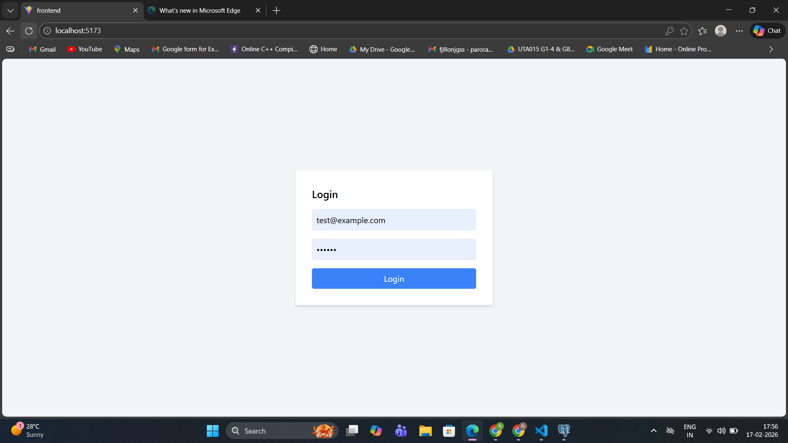
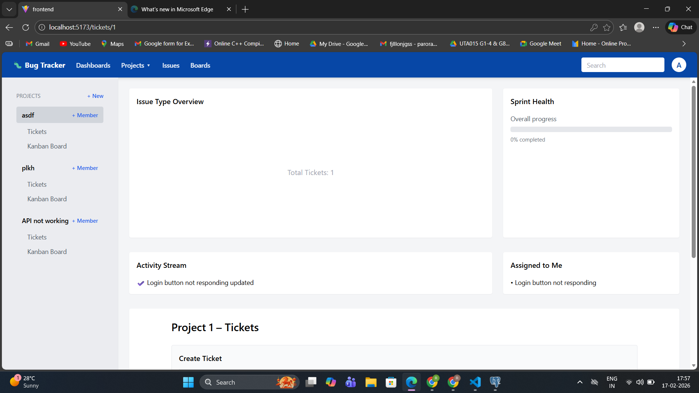
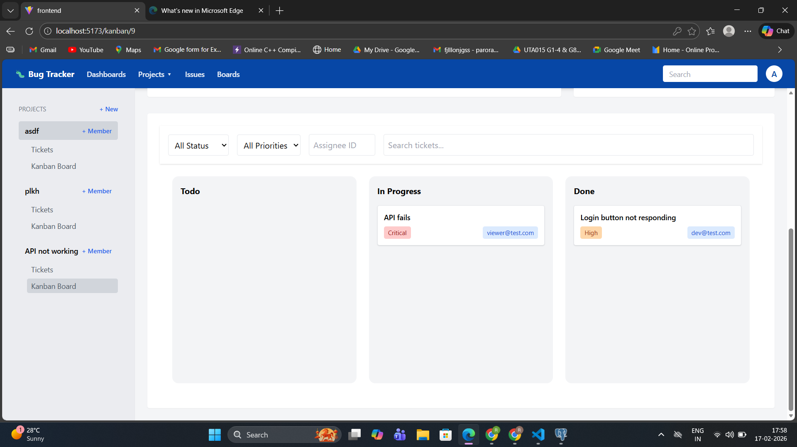
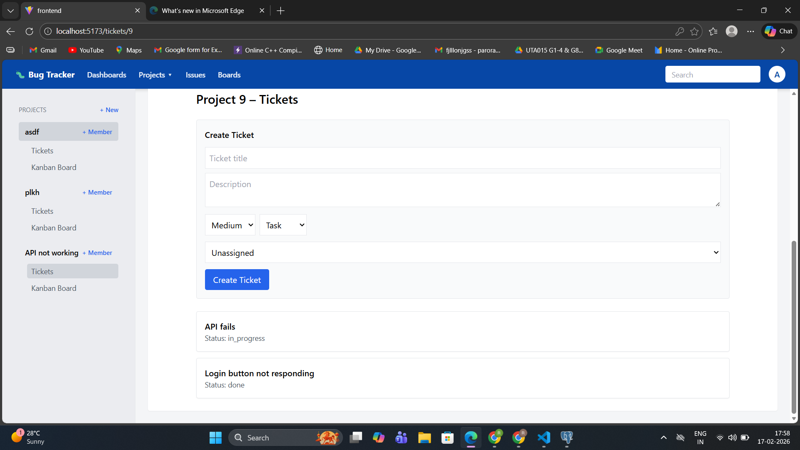
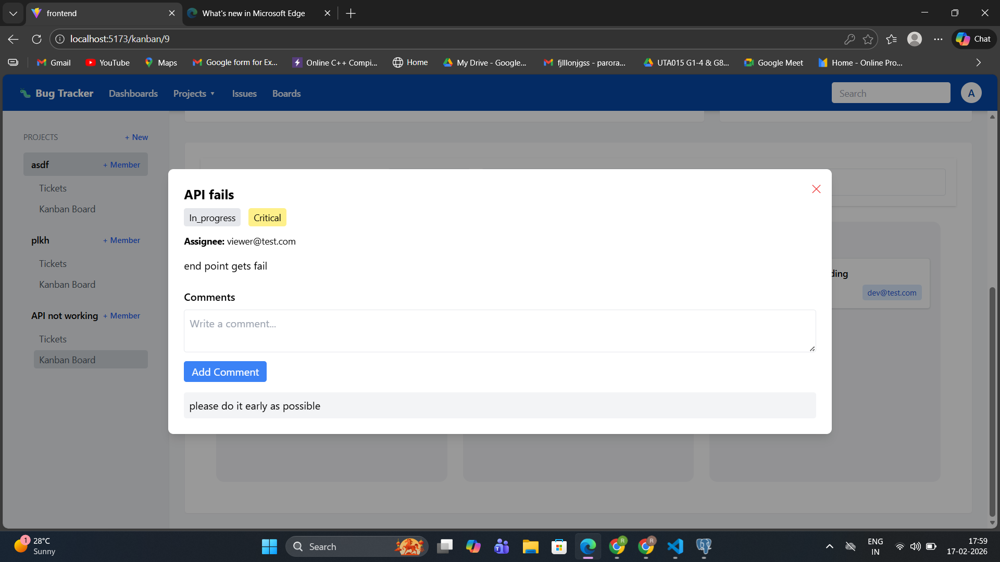
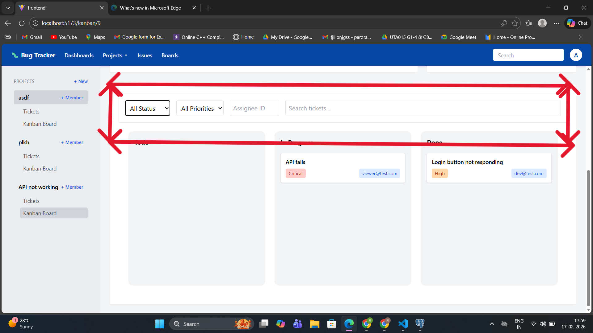
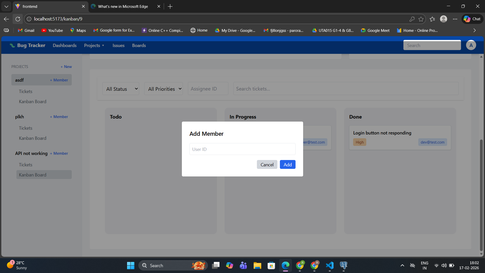
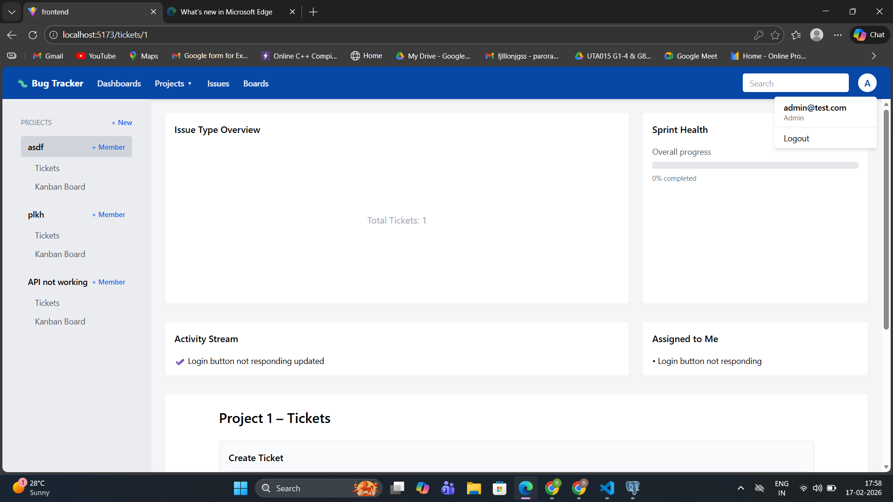

# 🐛 Issue Tracker Pro (Jira-Like System)

A production-grade Issue Tracking System built using **FastAPI + React**.  
Inspired by Jira, Linear, and ClickUp.

This application enables teams to manage projects, track bugs, assign work, collaborate, and visualize progress using a Kanban board.

---

# 🚀 Live Features

- JWT Authentication
- Role-Based Access Control (Admin, Developer, Viewer)
- Project & Team Management
- Ticket CRUD with relationships
- Drag-and-Drop Kanban Board
- Threaded Comments
- File Upload (Screenshots)
- Advanced Filtering & Search
- Swagger Auto API Docs
- Production Deployment Ready

---

# 🧱 Tech Stack

## Backend
- FastAPI
- SQLAlchemy
- PostgreSQL
- Pydantic
- Alembic
- JWT Authentication
- Passlib (Password Hashing)

## Frontend
- React.js
- Tailwind CSS
- Axios
- React Router
- dnd-kit (Kanban drag-and-drop)

---

# 🏗️ System Architecture

Frontend (React)
        |
        | HTTP (Axios)
        |
Backend (FastAPI)
        |
        | SQLAlchemy ORM
        |
PostgreSQL Database

Authentication Flow:
User -> Login -> JWT Token -> Sent in Authorization Header -> Backend validates -> Access Granted

---

# 📂 Project Structure

## Backend

```
backend/
│
├── app/
│   ├── main.py
│   ├── database.py
│   ├── models/
│   ├── schemas/
│   ├── routes/
│   ├── auth/
│   ├── utils/
│
├── alembic/
├── requirements.txt
```

---

# ⚙️ Backend Detailed Explanation

---

# 1️⃣ main.py

This is the application entry point.

### Responsibilities:
- Create FastAPI app instance
- Include all routers
- Enable CORS
- Initialize middleware

### Code Explanation:

```python
app = FastAPI()
```
Creates the FastAPI application object.

```python
app.include_router(auth_router)
```
Registers authentication routes.

```python
app.add_middleware(CORSMiddleware)
```
Allows frontend (React) to communicate with backend.

---

# 2️⃣ database.py

### Purpose:
Creates database connection.

```python
engine = create_engine(DATABASE_URL)
```
Creates connection to PostgreSQL.

```python
SessionLocal = sessionmaker()
```
Creates DB session for each request.

```python
Base = declarative_base()
```
Base class for all models.

---

# 3️⃣ User Model (models/user.py)

```python
class User(Base):
```
Defines user table.

### Fields:
- id (Primary Key)
- username
- email
- hashed_password
- role (Admin, Developer, Viewer)
- created_at

### Relationships:
```python
tickets = relationship("Ticket")
```
A user can have many tickets.

---

# 4️⃣ Project Model

```python
class Project(Base):
```

### Fields:
- id
- name
- description
- owner_id

### Relationship:
- A project has many tickets
- A project has many members

---

# 5️⃣ Ticket Model

```python
class Ticket(Base):
```

### Fields:
- id
- title
- description
- status (Todo, In Progress, Done)
- priority (Low, Medium, High)
- project_id
- assigned_to
- created_by
- created_at

### Why status field?
Used for Kanban drag-and-drop grouping.

---

# 🔐 Authentication System (auth/jwt.py)

---

## Password Hashing

```python
pwd_context.hash(password)
```

Hashes password securely using bcrypt.

---

## verify_password()

Compares raw password with hashed password.

---

## create_access_token()

```python
jwt.encode(data, SECRET_KEY)
```

Generates signed JWT token.

---

## get_current_user()

- Extracts token from Authorization header
- Decodes token
- Fetches user from database
- Returns user object

This is used as dependency in protected routes.

---

# 🛡️ Role-Based Access Control

We use dependency injection:

```python
def require_role(role: str)
```

Checks:
- If user.role == required_role
- Otherwise raises 403 Forbidden

Used in routes like:

```python
@router.delete("/ticket/{id}")
```
Only Admin or creator can delete.

---

# 📌 Ticket CRUD Routes

## Create Ticket

POST /tickets/

Steps:
1. Validate request body (Pydantic schema)
2. Create Ticket object
3. Assign current user as creator
4. Save to DB
5. Return ticket

---

## Get Tickets

GET /tickets/

Supports:
- Filtering by status
- Filtering by priority
- Filtering by assigned_to

Query parameters:

```
/tickets?status=Todo&priority=High
```

---

## Update Ticket

PATCH /tickets/{id}

Steps:
- Check permission
- Update only provided fields
- Commit changes

---

## Delete Ticket

DELETE /tickets/{id}

Checks:
- Only Admin or creator allowed

---

# 📊 Kanban Board Logic

Frontend groups tickets by:

- Todo
- In Progress
- Done

Drag Event Flow:

1. User drags ticket
2. dnd-kit triggers onDragEnd()
3. We update ticket.status
4. Axios PATCH request sent
5. Backend updates DB
6. UI refreshes

---

# 💬 Comments System

Each ticket can have many comments.

Comment Model:
- id
- content
- ticket_id
- user_id
- created_at

Allows threaded collaboration.

---

# 📎 File Upload

We use:

```python
UploadFile = File(...)
```

Steps:
1. Receive file
2. Save in uploads/ folder
3. Store file path in DB
4. Return file URL

---

# 🔍 Search & Filtering

Uses SQLAlchemy query filtering:

```python
query = db.query(Ticket)

if status:
    query = query.filter(Ticket.status == status)
```

This dynamically builds SQL query.

---

# 🌐 API Documentation

Swagger UI available at:

```
/docs
```

Auto-generated by FastAPI.

---

# 🚀 Deployment

## Backend Deployment (Railway)

1. Add Procfile
2. Set environment variables
3. Connect PostgreSQL
4. Run migrations
5. Deploy

---


# 🧪 API Testing

- Swagger UI
- Postman
- Pytest (Optional)

---

# 🧠 Scalability Considerations

- Use indexing on:
    - status
    - assigned_to
- Use Redis for caching
- Use Celery for background jobs
- Use pagination for large datasets

---

# 📈 Industry-Level Concepts Used

- Dependency Injection
- JWT Stateless Authentication
- ORM Abstraction
- Clean Architecture Separation
- RBAC Security
- Migration Management
- RESTful API Design
- Production Deployment

---

# 📌 Environment Variables

```
DATABASE_URL=
SECRET_KEY=
ALGORITHM=HS256
ACCESS_TOKEN_EXPIRE_MINUTES=30
```

---

# 🏁 Final Deliverables

✔ Deployed Backend  
✔ React Frontend  
✔ Kanban Workflow  
✔ JWT Secured APIs  
✔ GitHub Repository  

---

# 👩‍💻 Author

Reena Arora  
Full Stack Developer (FastAPI + React)

---

# ⭐ Future Improvements

- WebSockets for real-time Kanban updates
- Activity logs
- Email notifications
- OAuth login
- CI/CD pipeline
- Microservices migration

---

# 🎯 Conclusion

This project demonstrates:

- Advanced API design
- Secure backend authentication
- Real-world scalable architecture
- Production-ready deployment workflow

It reflects industry-grade backend engineering principles.











